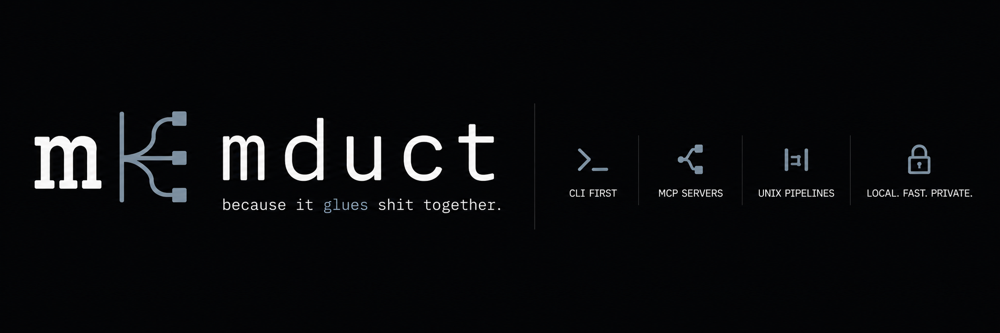
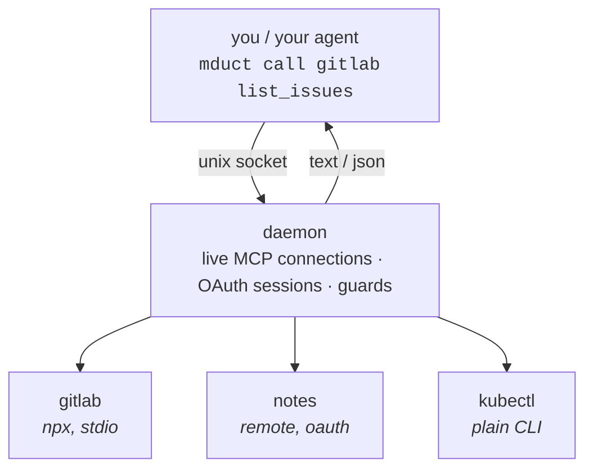

[](https://github.com/TheFox666/mduct/actions/workflows/ci.yml)

<p align="center"></p>

One binary that turns any MCP server into a Unix tool — pipeable, scriptable,
usable by hand — and keeps its tool schemas out of your model's context.

<p align="center"></p>

```sh
mduct call gitlab list_issues state=opened --json | jq '.[].title'
```

MCP servers don't come with a command line. This gives them one.
It is a duct. Things go through it.

## Why

An MCP server has no command line. It speaks JSON-RPC to an LLM client and that
is the whole of it — you cannot pipe it, script it, loop over it, put it in a
cron job, or try it by hand. Whatever it can do is reachable from exactly one
place.

mduct makes them shell citizens:

```sh
# every open MR whose source branch is already gone
mduct call gitlab list_merge_requests project_id=grp/proj state=opened --json \
  | jq -r '.[].source_branch' \
  | while read -r b; do git ls-remote --exit-code --heads origin "$b" >/dev/null || echo "stale: $b"; done

# the same tool, across a set of projects, in a loop
for p in api web worker; do
  mduct call gitlab list_pipelines project_id="grp/$p" --json | jq -c "{repo:\"$p\", last:.[0].status}"
done
```

None of that is possible against an MCP server otherwise, and none of it needs a
model. Humans get to use these servers too.

### The context bill is a side effect of the pipe

Because a shell sits in the middle, you filter *before* anything becomes
context. A tool that returns 20 issues returns 20 full issues; you wanted three
fields. Measured on a real call: 24,568 characters down to 1,768.

That is the part worth having. The schemas are the smaller half of the same
story: a client loads every connected server's tool definitions up front — one
GitLab server is 186 tools and ~168 kB of JSON Schema, call it 40k tokens before
the model reads your question. mduct leaves them on disk and puts one line per
server in the prompt instead:

```
MCP tools via `mduct` CLI (list+args: mduct tools <server>; call: mduct call <server> <tool> key=value):
  notes        — shared notes
      search(query, limit?)  get(id)  put(id, body)
  gitlab       — GitLab: MRs, pipelines, issues, repos
      189 tools — mduct tools gitlab
CLI tools via `mduct` CLI (what it can do: mduct tools <tool>; run: mduct run <tool> [args…]):
  kubectl      — read-only cluster access
```

2.9 kB for a seven-server setup. A server small enough carries its signatures so
an agent can see the call rather than remember to ask; a 189-tool one collapses
to a count and a pointer. The signatures come from a cache the daemon fills as it
is used, so the index never connects and works cold in a session hook.

Lazy-loading the schemas would fix the token bill and leave the interesting part
undone — and it introduces its own problem: out of context, out of mind. An
agent will not use a capability it cannot see.

## Install

```sh
brew install thefox666/tap/mduct
```

Or without Homebrew — fetches the release binary, checks its sha256, puts
`mduct` in `~/.local/bin`:

```sh
curl -fsSL https://raw.githubusercontent.com/TheFox666/mduct/main/install.sh | sh
```

`ubi --project TheFox666/mduct` and `mise use -g ubi:TheFox666/mduct` work too,
straight off the GitHub releases. From a checkout: `bun run build && cp
dist/mduct ~/.local/bin/`.

## Quickstart

**Stash a token.** `${VAR}` refs resolve from a 0600 store, so it never reaches
the config file:

```sh
echo "$YOUR_GITLAB_PAT" | mduct secret set GITLAB_PAT
```

**Declare a server** in `~/.config/mduct/servers.jsonc`:

```jsonc
{
  "servers": {
    // local: mduct launches the process and talks stdio
    "gitlab": {
      "command": "npx",
      "args": ["-y", "@yoda.digital/gitlab-mcp-server"],
      "env": { "GITLAB_PERSONAL_ACCESS_TOKEN": "${GITLAB_PAT}" },
      "guard": { "deny": ["delete_*"] },
      "note": "GitLab: MRs, pipelines, issues, repos"
    },
    // remote: nothing to install, mduct speaks HTTP to it
    "notes": { "url": "https://mcp.example.com/mcp", "auth": "oauth" }
  }
}
```

You don't have to hand-edit it. `mduct add` opens a picker and `mduct import`
lifts servers out of an existing Claude config.

**Call things.** The daemon autostarts:

```sh
mduct servers                 # what's configured
mduct tools gitlab            # tool names + signatures, no schemas
mduct schema gitlab create_issue
mduct call gitlab create_issue project=42 title="it broke again"
mduct status                  # which instance answered, and from where
```

**Wire an agent to it.** Claude Code and Codex both have hooks for this.
Anything else: paste `mduct index` into the system prompt.

```sh
mduct hook install claude     # ~/.claude/settings.json
mduct hook install codex      # ~/.codex/config.toml, in a marked block
```

Both take `--remove`. The Codex installer only ever rewrites the text between
its two comment markers, so the rest of your config stays yours.

## How it works



The CLI is a thin client. Everything with state lives in the daemon:
connections, tokens, guards. That is deliberate. A guard the model could reach
would be a suggestion.

You never start the daemon by hand:

```sh
mduct status              # up? which socket/config/secrets
mduct logs [server]       # recent activity
mduct daemon --stop       # next call restarts it
mduct daemon              # foreground, for when startup fails and you want to know why
mduct daemon --install    # systemd user unit, if you want it at login
```

## What else mduct does

| | |
|---|---|
| Warm daemon | Connections and OAuth sessions survive between calls. A stdio server isn't respawned and a remote isn't re-handshaked every time you invoke it. |
| Pipe-ready output | `--json` strips the prose some servers wrap around their payload. `--compact` minifies. Exit codes mean what you think they mean. |
| Guards in the daemon | Per-server `allow`/`deny` patterns, living somewhere the model cannot argue with them. |
| Secrets out of the config | `${VAR}` refs resolve from a 0600 store. Plaintext tokens never touch `servers.jsonc`. |
| MCP and plain CLIs | `kubectl`, `playwright` and friends show up in the same list and are called the same way. Nobody has to care which is which. |
| Isolated instances | One env var gives a second agent its own config, secrets, auth and daemon. |
| Oversized-result guard | A result past `warnAbove` characters prints a ready-made `jq` projection instead of quietly costing you 40k characters. |

## Calling a tool: arguments and output

httpie-style, because typing JSON on a command line is a punishment:

```sh
mduct call srv tool key=value                  # scalar (ints, floats, bools coerced)
mduct call srv tool ids:='[1,2,3]'             # := parses the value as JSON
mduct call srv tool --args '{"deep":{"x":1}}'  # whole object, wins on conflict
mduct call srv tool --raw                      # full MCP envelope instead of the text
mduct call srv tool --json | jq .              # strip the server's prose
```

More argument forms and the output contract: [Arguments & output](../../wiki/Arguments-and-output).

## Configuration

`~/.config/mduct/servers.jsonc`, in JSONC so your comments survive. Two
sections that behave the same from outside, `servers` for MCP and `tools` for
plain CLIs, plus `defaults`.

```jsonc
"tools": {
  "kubectl": {
    "run": "kubectl",
    "args": ["--insecure-skip-tls-verify=true"],
    "env": { "KUBECONFIG": "${HOME}/.kube/test.yaml" },
    "check": "kubectl version --client",
    "note": "read-only cluster access"
  }
}
```

```sh
mduct tools kubectl                      # what it can do — the tool's own help, through its wrapper
mduct run kubectl get pods -n default    # with the tool's env/wrapping applied
mduct tool status                        # installed / missing, + update hints for pinned npm tools
```

`mduct tools <name>` answers for both kinds. For an MCP server it lists tool
signatures; for a CLI tool it runs that tool's help. Otherwise the only way to
discover a CLI tool's surface is to already know it.

A CLI is not always enough — sometimes a script needs the library behind it.
Declare it, and mduct keeps a pinned copy and hands you the environment:

```jsonc
"playwright": { "run": "bunx", "args": ["playwright@1.61.1"], "lib": "playwright@1.61.1" }
```

```sh
mduct tool setup playwright      # installs the library into the instance cache
eval "$(mduct env playwright)"   # NODE_PATH, plus whatever env the tool declares
node screenshot.js               # require("playwright") resolves, at the pinned version
```

Every field with its default: [Configuration](../../wiki/Configuration).

### Guard

```jsonc
"guard": { "allow": ["list_*", "get_*"] }   // read-only, whatever the model would prefer
```

Enforced in the daemon. A denied call fails the same way for a human and for an
agent having a bad day.

### Named instances

```sh
mduct servers                            # ~/.config/mduct/
MDUCT_PROFILE=ci mduct servers           # ~/.config/mduct-ci/, own socket, own secrets
```

| Variable | Effect |
|---|---|
| `MDUCT_PROFILE` | named instance → `~/.config/mduct-<profile>/` + its own socket |
| `MDUCT_CONFIG` | config path |
| `MDUCT_SECRETS` | secret store |
| `MDUCT_SOCKET` | daemon socket |

### Parallel calls

One call at a time per server, because the failure path closes the transport and
not every MCP server is reentrant. If yours is, say so and calls overlap:

```jsonc
"gitlab": { "command": "…", "maxConcurrent": 5 }
```

Measured with a 300 ms tool, five calls at once: 1561 ms serialised, 360 ms with
`maxConcurrent: 5`. Start at 3 or 4 rather than a big number, and watch the
server's own rate limit rather than mduct's.

## Putting MCP tool names in the agent's tool namespace

The prompt block is prose, and prose competes with habit. Tool *selection*
happens in the namespace, and nothing written into a prompt lands there.

`mduct mcp` is a second face for exactly that: an MCP server whose `tools/list`
mirrors the real tools, so their names sit where an agent looks. It does not
execute. Each entry's description is the shell command to run:

```
hive__find_symbol   $ mduct call hive find_symbol name=… repo=… — where a symbol is defined
```

Calls stay in the shell, because the shell is the part worth keeping: `--json |
jq`, redirection, loops. Running results back through MCP would hand every
payload straight into the context.

```jsonc
"kb": { "command": "…", "mcpCatalog": true }   // opt in, per server
```

```sh
mduct hook install claude              # registers the catalogue too
mduct hook install codex               # same, as [mcp_servers.mduct]
```

The catalogue reloads itself: it watches the config and its tool cache, and sends
`notifications/tools/list_changed` when what it would serve actually differs. Flip
`mcpCatalog` on a server, or call a server for the first time so its tools become
known, and the names appear in a running session — no restart, and no wake-up for
a rewrite that changed nothing.

Hooks live in `settings.json` and MCP servers in `.claude.json`, so the install
touches both — leaving the second to you is an install that half-works and a
catalogue nobody sees. `--remove` takes it back out, and session start says so
if a server declares `mcpCatalog` while the server is not registered. Codex keeps
hooks and servers in the same TOML, which makes that install the easier of the two.

### Which servers to mirror

Not the ones you talk about. "Look at the GitLab MR" or "file a Linear ticket"
names the server, and the request drags the tool in by itself. The ones worth
the namespace are the servers **no request ever names** — a code index, a
knowledge base, anything an agent is supposed to reach for on its own initiative
while doing something else. That is exactly where a prose line loses to habit.

Cost keeps the list short: a catalogue entry runs about six times the prose line
for the same tool. Measured on one setup — 15 tools are 2.5 kB as a catalogue
against 0.75 kB as signatures in the index; a 189-tool server would be 29 kB. A
catalogued server drops its signatures from the prompt block, so you never pay
for both.

## Shadowing

A server can declare which *other* tool calls it could have served, and mduct
says so at the moment of the call. The call still runs — the note rides along
with its result — and a token bucket decides how often it speaks:

```jsonc
"shadow": [{
  "tool": ["Grep"],
  "bash": "(?:^|[\\n;]|&&)\\s*(grep|rg|ugrep)\\b",
  "pathIn": ["~/src/bigrepo"],
  "hint": "That repo is indexed — `mduct call codeindex search query=…` is faster.",
  "budget": 2,
  "refillMin": 30
}]
```

This exists because a prompt block is read once and then loses to habit.
Measured on one two-day session: 21 calls to a code-index server against 270
greps into the repos that server had indexed, with the index block sitting in
context the entire time. The agent knew. It reached for grep anyway.

The note arrives as `additionalContext`, never as an approval: a nudge must not
widen permissions, so a call that would have asked still asks. A rule that really
must stop something sets `block: true` and gets the old denial back.

`mduct shadow` counts nudges against follow-up calls, so you can tell whether the
hint changes anything. Tuning and details: [Shadowing](../../wiki/Shadowing).

## Secrets & OAuth

```sh
echo "$TOKEN" | mduct secret set GITLAB_PAT   # or a hidden prompt
mduct secret list                             # names, never values
mduct auth notes                              # browser consent once; daemon refreshes after that
```

`mduct add --env` and `mduct import` move literal values into the store and
leave a `${ref}` behind.

## Import & registry

```sh
mduct add                              # picker: ↑↓/jk, / to search the registry, ⏎ toggle, q quit
mduct import                           # MCP servers found in existing Claude configs
mduct search gitlab                    # the public registry
mduct add com.gitlab/mcp --as gitlab   # install by ref, version-pinned
mduct doctor                           # servers attached directly AND served here (you want zero)
```

## Wiki

| | |
|---|---|
| [Cookbook](../../wiki/Cookbook) | jq pipelines, batching, CI, read-only agents, a second instance |
| [Configuration](../../wiki/Configuration) | every field, with defaults and failure modes |
| [Arguments & output](../../wiki/Arguments-and-output) | argument forms, the output contract, exit codes |
| [Agent integration](../../wiki/Agent-integration) | Claude and Codex hooks, the prompt block, other harnesses |
| [Shadowing](../../wiki/Shadowing) | nudge rules, buckets, measurement |
| [Troubleshooting](../../wiki/Troubleshooting) | when the daemon sulks |

## Contributing

[CONTRIBUTING.md](CONTRIBUTING.md) — mostly the four constraints a change must
not cross, so nobody finds out after writing it, plus the one house rule: a
change that can break carries a test that fails without it.

## Not built yet

npm. It would mean either four platform packages of a ~90 MB binary, or dropping
the Bun APIs the daemon is built on — `Bun.listen`, `Bun.connect`, `Bun.serve`
are the unix socket and the OAuth callback — for their node equivalents. About
150 lines, and then `npx mduct` would work without installing anything.

Windows, for the same reason: the IPC is a unix socket.

MIT.
