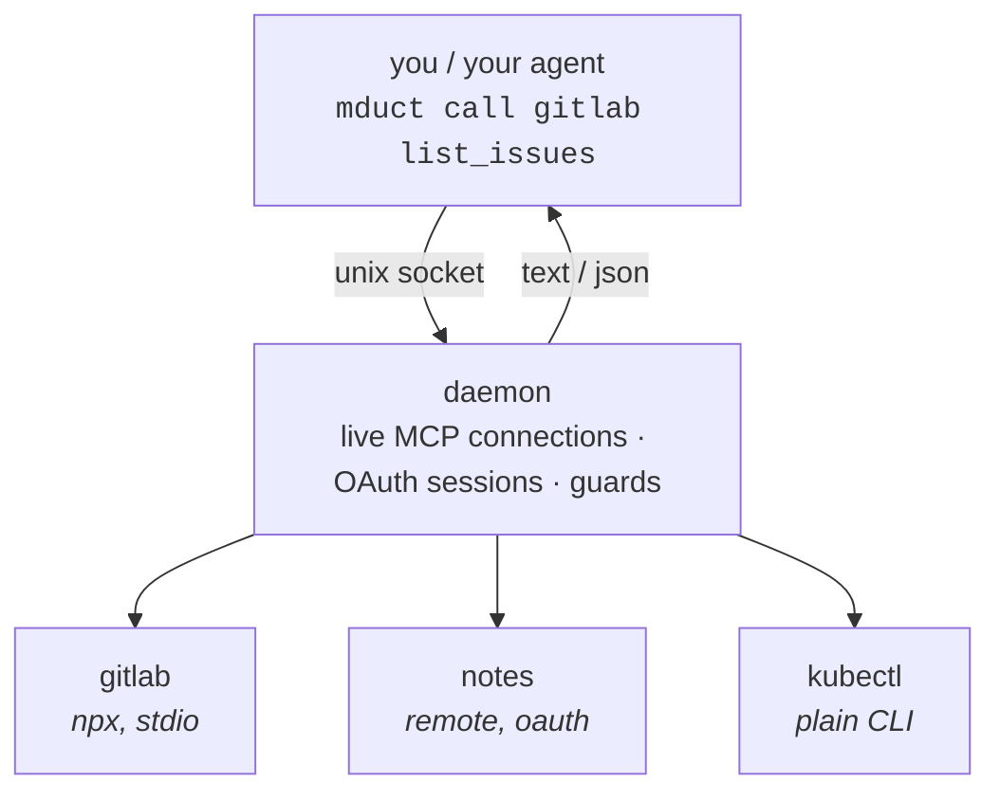

<p align="center"></p>

One binary in front of any number of MCP servers and plain CLIs, with none of
their tool schemas in your model's context.

<p align="center"></p>

```sh
mduct call gitlab list_issues state=opened --json | jq '.[].title'
```

It is a duct. Things go through it.

## Why

An MCP client loads every connected server's tool schemas up front, all of them.
Measured on one GitLab server: 186 tools, about 168 kB of JSON Schema, roughly
40k tokens spent before the model has read your question. You pay it again on
every context refresh, mostly for tools nobody calls.

mduct puts one line per server in the prompt, about 20 tokens each, and leaves
the schemas on disk until something calls a tool. That is the whole trick.

Loading them lazily would fix the token bill and introduce a worse problem: out
of context, out of mind. An agent will not use a capability it cannot see.

## Install

```sh
curl -fsSL https://raw.githubusercontent.com/TheFox666/mduct/main/install.sh | sh
```

Fetches the release binary, checks its sha256, puts `mduct` in `~/.local/bin`.
From a checkout: `bun run build && cp dist/mduct ~/.local/bin/`.

## Quickstart

**Stash a token.** `${VAR}` refs resolve from a 0600 store, so it never reaches
the config file:

```sh
echo "$YOUR_GITLAB_PAT" | mduct secret set GITLAB_PAT
```

**Declare a server** in `~/.config/mduct/servers.jsonc`:

```jsonc
{
  "servers": {
    // local: mduct launches the process and talks stdio
    "gitlab": {
      "command": "npx",
      "args": ["-y", "@yoda.digital/gitlab-mcp-server"],
      "env": { "GITLAB_PERSONAL_ACCESS_TOKEN": "${GITLAB_PAT}" },
      "guard": { "deny": ["delete_*"] },
      "note": "GitLab: MRs, pipelines, issues, repos"
    },
    // remote: nothing to install, mduct speaks HTTP to it
    "notes": { "url": "https://mcp.example.com/mcp", "auth": "oauth" }
  }
}
```

You don't have to hand-edit it. `mduct add` opens a picker and `mduct import`
lifts servers out of an existing Claude config.

**Call things.** The daemon autostarts:

```sh
mduct servers                 # what's configured
mduct tools gitlab            # tool names + signatures, no schemas
mduct schema gitlab create_issue
mduct call gitlab create_issue project=42 title="it broke again"
mduct status                  # which instance answered, and from where
```

**Wire an agent to it.** Claude Code has hooks for this. Anything else: paste
`mduct index` into the system prompt.

```sh
mduct hook install claude
```

## How it works



The CLI is a thin client. Everything with state lives in the daemon:
connections, tokens, guards. That is deliberate. A guard the model could reach
would be a suggestion.

You never start the daemon by hand:

```sh
mduct status              # up? which socket/config/secrets
mduct logs [server]       # recent activity
mduct daemon --stop       # next call restarts it
mduct daemon              # foreground, for when startup fails and you want to know why
mduct daemon --install    # systemd user unit, if you want it at login
```

## What else is in there

| | |
|---|---|
| Warm daemon | Connections and OAuth sessions survive between calls. A stdio server isn't respawned and a remote isn't re-handshaked every time you invoke it. |
| Pipe-ready output | `--json` strips the prose some servers wrap around their payload. `--compact` minifies. Exit codes mean what you think they mean. |
| Guards in the daemon | Per-server `allow`/`deny` patterns, living somewhere the model cannot argue with them. |
| Secrets out of the config | `${VAR}` refs resolve from a 0600 store. Plaintext tokens never touch `servers.jsonc`. |
| MCP and plain CLIs | `kubectl`, `playwright` and friends show up in the same list and are called the same way. Nobody has to care which is which. |
| Isolated instances | One env var gives a second agent its own config, secrets, auth and daemon. |
| Oversized-result guard | A result past `warnAbove` characters prints a ready-made `jq` projection instead of quietly costing you 40k characters. |

## Arguments

httpie-style, because typing JSON on a command line is a punishment:

```sh
mduct call srv tool key=value                  # scalar (ints, floats, bools coerced)
mduct call srv tool ids:='[1,2,3]'             # := parses the value as JSON
mduct call srv tool --args '{"deep":{"x":1}}'  # whole object, wins on conflict
mduct call srv tool --raw                      # full MCP envelope instead of the text
mduct call srv tool --json | jq .              # strip the server's prose
```

More argument forms and the output contract: [Arguments & output](../../wiki/Arguments-and-output).

## Configuration

`~/.config/mduct/servers.jsonc`, in JSONC so your comments survive. Two
sections that behave the same from outside, `servers` for MCP and `tools` for
plain CLIs, plus `defaults`.

```jsonc
"tools": {
  "kubectl": {
    "run": "kubectl",
    "args": ["--insecure-skip-tls-verify=true"],
    "env": { "KUBECONFIG": "${HOME}/.kube/test.yaml" },
    "check": "kubectl version --client",
    "note": "read-only cluster access"
  }
}
```

```sh
mduct run kubectl get pods -n default    # with the tool's env/wrapping applied
mduct tool status                        # installed / missing, + update hints for pinned npm tools
```

Every field with its default: [Configuration](../../wiki/Configuration).

### Guard

```jsonc
"guard": { "allow": ["list_*", "get_*"] }   // read-only, whatever the model would prefer
```

Enforced in the daemon. A denied call fails the same way for a human and for an
agent having a bad day.

### Named instances

```sh
mduct servers                            # ~/.config/mduct/
MDUCT_PROFILE=ci mduct servers           # ~/.config/mduct-ci/, own socket, own secrets
```

| Variable | Effect |
|---|---|
| `MDUCT_PROFILE` | named instance → `~/.config/mduct-<profile>/` + its own socket |
| `MDUCT_CONFIG` | config path |
| `MDUCT_SECRETS` | secret store |
| `MDUCT_SOCKET` | daemon socket |

## Shadowing

A server can declare which *other* tool calls it could have served, and mduct
says so at the moment of the call. A token bucket decides how often. The answer
is never "no":

```jsonc
"shadow": [{
  "tool": ["Grep"],
  "bash": "(?:^|[\\n;]|&&)\\s*(grep|rg|ugrep)\\b",
  "pathIn": ["~/src/bigrepo"],
  "hint": "That repo is indexed — `mduct call codeindex search query=…` is faster.",
  "budget": 2,
  "refillMin": 30
}]
```

This exists because a prompt block is read once and then loses to habit.
Measured on one two-day session: 21 calls to a code-index server against 270
greps into the repos that server had indexed, with the index block sitting in
context the entire time. The agent knew. It reached for grep anyway.

`mduct shadow` counts nudges against follow-up calls, so you can tell whether
it earns its friction or is just being annoying. Tuning and details:
[Shadowing](../../wiki/Shadowing).

## Secrets & OAuth

```sh
echo "$TOKEN" | mduct secret set GITLAB_PAT   # or a hidden prompt
mduct secret list                             # names, never values
mduct auth notes                              # browser consent once; daemon refreshes after that
```

`mduct add --env` and `mduct import` move literal values into the store and
leave a `${ref}` behind.

## Import & registry

```sh
mduct add                              # picker: ↑↓/jk, / to search the registry, ⏎ toggle, q quit
mduct import                           # MCP servers found in existing Claude configs
mduct search gitlab                    # the public registry
mduct add com.gitlab/mcp --as gitlab   # install by ref, version-pinned
mduct doctor                           # servers attached directly AND served here (you want zero)
```

## Wiki

| | |
|---|---|
| [Cookbook](../../wiki/Cookbook) | jq pipelines, batching, CI, read-only agents, a second instance |
| [Configuration](../../wiki/Configuration) | every field, with defaults and failure modes |
| [Arguments & output](../../wiki/Arguments-and-output) | argument forms, the output contract, exit codes |
| [Agent integration](../../wiki/Agent-integration) | Claude hooks, the prompt block, other harnesses |
| [Shadowing](../../wiki/Shadowing) | nudge rules, buckets, measurement |
| [Troubleshooting](../../wiki/Troubleshooting) | when the daemon sulks |

## Not built yet

npm and Homebrew channels. For now it is `install.sh` (release binary plus
checksum) or `bun run build`.

MIT.
